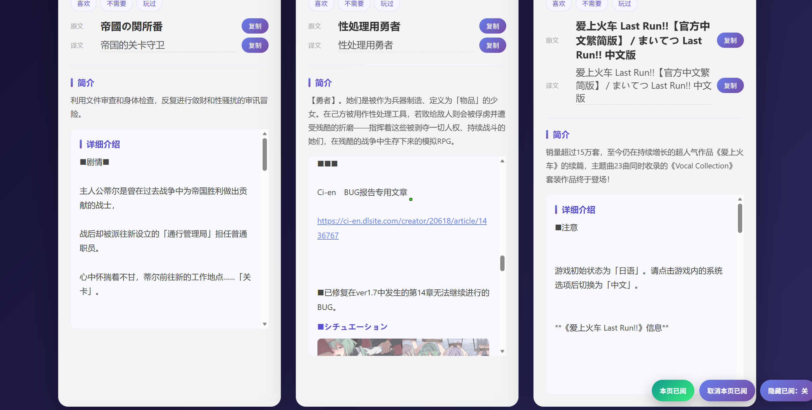

# Better DLsite

一个用于爬取 DLsite 同人作品信息、生成翻译稿件、并本地展示的工具集。

> **翻译软件推荐**：只推荐使用 [LinguaGacha](https://github.com/neavo/LinguaGacha)。
>
> 如果使用 DeepSeek 翻译，**请务必关闭思考模式**，否则会产生高额费用。
>
> 本项目已附带可用的翻译稿（`翻译稿.rar`），解压后可直接使用。

## 功能概览

- **爬取作品信息** — 从 DLsite 搜索页批量抓取作品 HTML，自动下载图片
  - 支持 RJ/VJ 作品
  - 支持多链接队列爬取，支持并发处理多个分类 URL
  - 支持只下载有字幕的音声 ASMR，可选择仅使用本地缓存或缓存缺失时回源 API
  - 支持 URL 历史记录和多选历史 URL
  - 支持 `getall` 命令一键从 `list.devtools` 添加全部分类
  - 自动检测 URL 是否包含 `genre[0]` 参数
  - 自动合并同一 `genre[0]` 的重复分类
  - `DownloadCoordinator` 避免多个并发分类重复下载同一作品
- **生成翻译稿件** — 解析 HTML 生成待翻译 Markdown 文件
- **导入翻译结果** — 将翻译好的 Markdown 应用到 JSON 数据
- **本地网页展示** — 启动本地服务器，以网页形式浏览作品
  - 作品卡左上角 RJ/VJ 编号可点击复制
  - 作品标题可点击复制
  - 右上角有搜索框，支持拼音和拼音首字母搜索
  - 分类筛选器支持实时搜索过滤
  - 支持按分类和作品类型筛选
  - 支持本地状态标记（喜欢、不需要、玩过、已阅）
  - 支持局域网访问，状态数据在设备间共享
  - 默认只展示一个语言版本（优先简体中文）和一个平台版本（优先 PC 版），可切换显示全部版本
  - 支持作品类型筛选（有字幕ASMR/无字幕ASMR/漫画/游戏）
  - 自动使用 DLsite 官方分类的简体中文名称

## 展示




## 目录结构

```
├── crawler.py                # 爬虫脚本
├── generate.py               # 生成 JSON 和翻译稿
├── md_to_json.py             # 导入翻译结果
├── open_page.py              # 启动本地展示页
├── cleanup_works.py          # 清理不在 crawl_results 中的 HTML
├── split_to_ai.py            # 分割待翻译文件到 ai 文件夹
├── retry_failed.py           # 重试下载失败的作品
├── update_asmr_subtitles.py  # 更新 ASMR 字幕缓存
├── gui/                      # GUI 应用
│   ├── main.py               # GUI 主程序
│   └── run.bat               # Windows 启动脚本
├── works/                    # 爬取的 HTML 文件
├── 待翻译/                   # 生成的待翻译稿件
├── 翻译稿/                   # 翻译完成的稿件
├── output/                   # 生成的展示数据
│   ├── index.html            # 展示页入口
│   ├── images/               # 下载的图片
│   └── data/
│       ├── json/             # 作品 JSON 数据
│       ├── orig/             # 原文对照
│       ├── translate/        # 翻译数据
│       ├── filter_index/     # 筛选索引
│       ├── categories.json   # 分类配置
│       ├── search_index.json # 搜索索引
│       └── work_states.json  # 作品状态
├── crawl_results.json        # 爬取分类记录
├── works_order.json          # 作品人气排序
├── url_history.json          # URL 历史记录
└── asmr_subtitle_cache.json  # ASMR 字幕缓存
```

## 使用流程

### 1. 爬取作品

#### 方式1：交互模式

```bash
python crawler.py
```

运行后：
1. 输入 DLsite 搜索/分类页 URL（可输入多个）
2. 输入 `all` 可使用全部历史 URL，或输入逗号分隔的序号选择多个历史 URL
3. 输入 `getall` 可从 `list.devtools` 一键添加全部分类到队列
4. 输入新 URL 会自动追加到历史中不重复（URL 必须包含 `genre[0]` 参数）
5. 设置同时并发处理几个链接
6. 设置每个链接最大爬取页数（0 = 不限制）
7. 可选择是否只下载有字幕的音声 ASMR
8. 可选择是否只使用本地字幕缓存（默认是，避免 API 限流）
9. 爬虫自动下载作品 HTML 到 `works/` 目录

#### 方式2：命令行参数

```bash
# 单个 URL
python crawler.py "DLsite分类URL" 0

# 多个 URL
python crawler.py "DLsite分类URL1" "DLsite分类URL2" 0

# 设置链接并发数
python crawler.py "DLsite分类URL" 0 --url-concurrency 3

# 只下载有字幕的音声 ASMR（仅本地缓存）
python crawler.py "DLsite分类URL" 0 --subtitle-asmr-only --subtitle-cache-only

# 只下载有字幕的音声 ASMR（缓存缺失时回源 API）
python crawler.py "DLsite分类URL" 0 --subtitle-asmr-only --subtitle-refresh-missing
```

### 1.5. 更新 ASMR 字幕缓存（可选）

```bash
python update_asmr_subtitles.py
```

运行后选择：
1. 补查未确认音声 ASMR
2. 复查已标为无字幕的音声 ASMR
3. 同步官方有字幕作品目录

输入 `auto` 可自动调整并发数（遇到 429 自动降速）。

### 2. 生成数据

```bash
python generate.py
```

功能：
- 解析 `works/` 下的 HTML 文件（线程池解析，带进度/ETA）
- 下载作品图片（轮播图、内容图）
- 生成 JSON 数据到 `output/data/json/`
- 生成待翻译稿件到 `待翻译/`（多语言版本按组去重，同组只生成一个稿）
- 生成原文对照到 `output/data/orig/`
- 生成搜索索引和筛选索引
- 根据 `asmr_subtitle_cache.json` 细化作品类型（有字幕ASMR/无字幕ASMR）
- 自动从 `list.devtools` 读取分类映射，规范化分类名为简体中文
- 自动按 `genre[0]` 合并重复分类

如需刷新 ASMR 字幕类型：
```bash
python generate.py --refresh-asmr-subtitles
```

### 3. 翻译作品

将 `待翻译/` 中的 `.md` 文件翻译后：
- 保存为 `翻译稿/RJxxxxxx.zh.md`
- 或直接覆盖 `待翻译/RJxxxxxx.md` 并重命名为 `.zh.md`

### 4. 导入翻译

```bash
python md_to_json.py
```

功能：
- 读取 `翻译稿/` 下的翻译文件
- 将翻译应用到 JSON 数据（多语言版本会自动复用译文，同组任一版本的翻译会应用到该组所有版本）
- 归档已翻译的待翻译文件

### 5. 查看展示页

```bash
python open_page.py
```

或直接运行：
```bash
启动网页.bat
```

自动打开浏览器访问 `http://localhost:8080`

## 辅助脚本

### cleanup_works.py

删除 `works/` 中不存在于 `crawl_results.json` 的 HTML 文件：

```bash
python cleanup_works.py
```

### split_to_ai.py

将 `待翻译/` 中的文件分割复制到 `ai/` 文件夹（每 1000 个一组）：

```bash
python split_to_ai.py
```

### retry_failed.py

重试下载 `failed_works.md` 中记录的失败作品：

```bash
python retry_failed.py
```

功能：
- 解析失败作品列表，提取作品 ID 和 URL
- 并发重试下载（默认 10 个并发）
- 自动切换 URL 格式（announce ↔ work）
- 成功下载的作品从列表中移除
- 全部成功时自动删除 `failed_works.md`

### update_asmr_subtitles.py

更新 ASMR 字幕缓存：

```bash
python update_asmr_subtitles.py
```

功能：
1. 补查未确认音声 ASMR
2. 复查已标为无字幕的音声 ASMR
3. 同步官方有字幕作品目录（增量更新，支持断点续传）
- 支持自动调整并发数（遇到 429 自动降速）
- 显示进度条和统计信息
- 支持拼音和拼音首字母搜索

## GUI 应用

提供基于 PyQt5 的图形界面，整合核心流程：

### 依赖

```bash
pip install PyQt5 aiohttp
```

### 运行

```bash
# 方式1：双击 gui/run.bat
# 方式2：命令行
python gui/main.py
```

### 功能

- **开始爬取**：输入 URL 和页数后，自动执行：爬取 → 生成网页数据 → 导入翻译
- **打开网页**：启动本地服务器

## 依赖

- Python 3.10+
- aiohttp
- aiofiles

安装依赖：
```bash
pip install aiohttp aiofiles
```

## 文件说明

| 文件 | 说明 |
|------|------|
| `crawl_results.json` | 记录每次爬取的分类信息、作品 ID 列表 |
| `works_order.json` | 作品按人气排序的 ID 列表 |
| `url_history.json` | 爬虫使用过的 URL 历史 |
| `failed_works.md` | 下载失败的作品记录 |
| `asmr_subtitle_cache.json` | ASMR 字幕缓存，记录哪些音声有字幕 |
| `output/data/work_states.json` | 作品状态（喜欢/不需要/玩过/已阅），局域网共享 |

## 注意事项

- 爬虫需要网络访问 DLsite
- 图片下载支持断点续传（已下载的会跳过）
- 翻译稿命名格式：`RJxxxxxx.zh.md` 或 `VJxxxxxx.zh.md`
